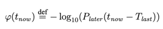
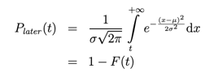
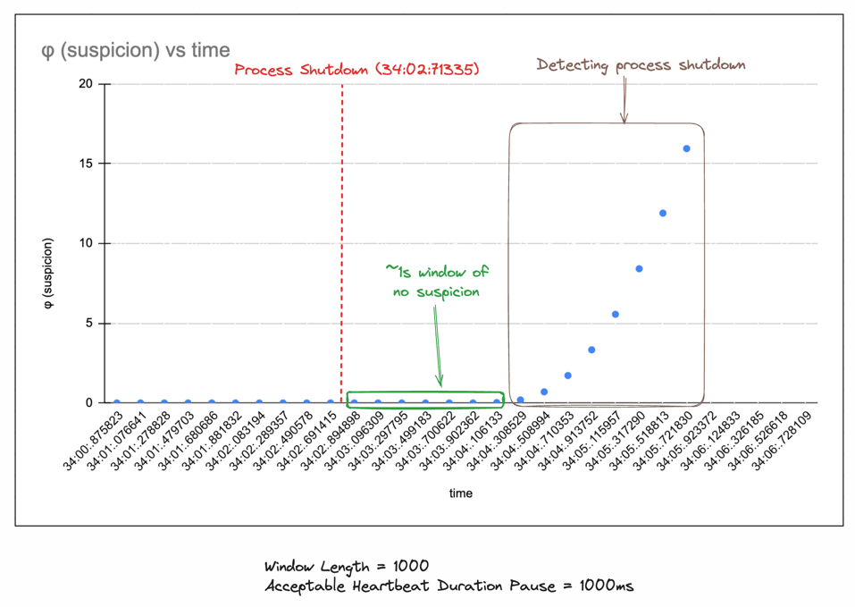

# Phi Accrual Detector

### Introduction
This is a pluggable implementation of phi accrual detection algorithm (introduced in this [paper](https://www.researchgate.net/publication/29682135_The_ph_accrual_failure_detector)) in Rust. 
The algorithm is used to detect changes in the behavior of a system by monitoring the time between events. 
Let's say you want to monitor whether the server is alive or not (imagine a master / slave setup), and you want to check
if the slave is still up or not? **How would you do it?**

### Solving the heartbeat issue
Heartbeats must've been the first thing coming to your mind, if master notices that slave doesn't ping me withing a fixed
interval, i'd consider it down. But sometimes the slave is just slightly late ,ex: interval is set to 500 ms and slave gives
the heartbeat ping at 550ms, it's not dead right? How do you combat this?

### Introducing φ
φ is defined as the suspicion level that the monitored system has failed. The algorithm works by keeping track of the 
time between events and calculating the probability that the system has failed. The algorithm is based on the
observation that the time between events in a healthy system follows a normal distribution, while the time between 
events in a failed system follows a distribution with a longer tail.

**The higher the φ, the lower the chances of receiving a heartbeat at a given time** (the formal definition is described below)

Where `F(t)` is the cumulative distribution function of the normal distribution, `μ` is the mean of the normal distribution, 
`σ` is the standard deviation of the normal distribution, and `t` is the time between events.

### Example Run
You can use the examples/monitor.rs to emulate the following result. the graph signifies that the suspicion level
is generally low if the process keeps pinging the monitor until it crashed at the red line. After that the suspicion
level increases exponentially and goes to infinity. You can configure any threshold (ex : `> 5.0`) to consider the process
as dead.

### Including acceptable heartbeat pauses
You can also include some pause durations to ensure that the system is not considered dead if it's just slightly late due to
network latencies. You can utilize `::with_acceptable_heartbeat_pause` to create a detector with acceptable pause durations.

